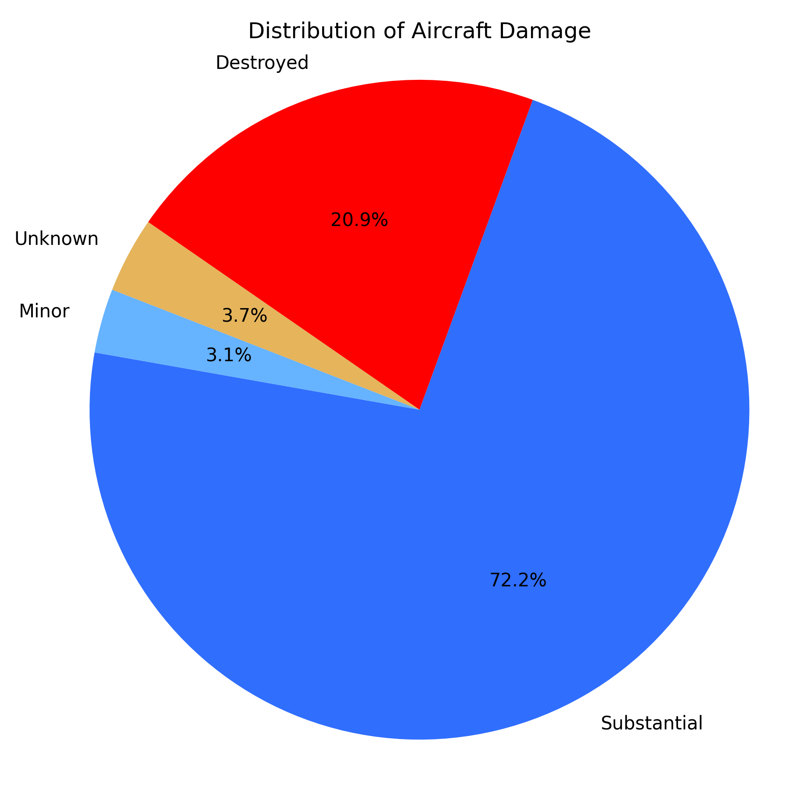
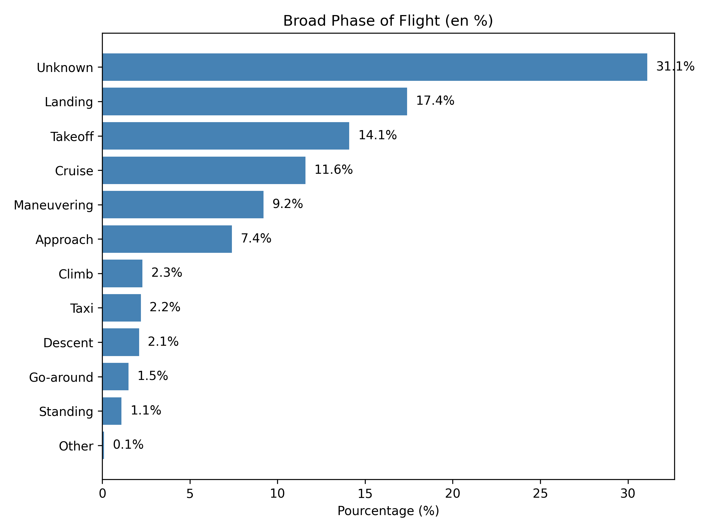
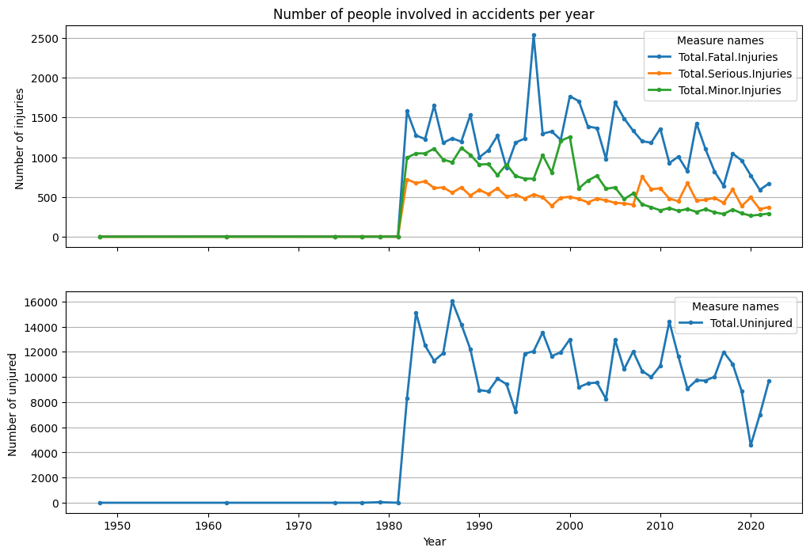

# ✈️ Aviation Safety Analysis  

# Project Title  
**Aircraft Risk Analysis for Safer Commercial and Private Aviation**

## 🧭 Overview  
This project explores aviation accident data to identify the safest aircraft models for continued operation in commercial and private sectors. Using historical records from the National Transportation Safety Board (NTSB), the analysis provides data-driven recommendations to enhance flight safety and inform fleet management decisions.

## 💼 Business Understanding  
In the aviation industry, selecting the safest and most reliable aircraft models is crucial for minimizing risk, improving public confidence, and reducing long-term operational losses.

This project aims to:
- Identify aircraft types with the highest and lowest incident severity  
- Recommend aircraft models that are still actively used and demonstrate strong safety records  
- Support decision-making for fleet acquisition or phase-out

## 📊 Data Understanding  
The dataset includes over 80,000 civil aviation accident records from 1962 to 2023, sourced from the NTSB.

Key variables include:
- Aircraft `Make` and `Model`  
- Injury counts: `Fatal`, `Serious`, `Minor`, and `Uninjured`  
- `Event.Date`, `Location`, `Phase.of.Flight`  
- Technical attributes: `Number.of.Engines`, `Engine.Type`, etc.

## 🛠️ Data Preparation  
The dataset was cleaned and transformed as follows:
- Dropped rows with missing essential values (`Make`, `Model`, `Event.Date`)  
- Filled injury-related nulls with 0 or `"Unknown"`  
- Extracted `Event.Year` from the event date  
- Aggregated injury statistics by aircraft model  
- Standardized text formatting (e.g., model names)

## 📈 Analysis and Results

### 🔹 Aircraft Damage Breakdown  

### 🔹 Flight Phase During Accidents  

### 🔹 Injury Distribution by Aircraft  

### ✅ Final Aircraft Recommendations

#### 1. **Boeing 737** – Commercial Mainstay with Strong Safety Record  
- **Fatality Rate:** 4.9% (1,348 fatalities out of 27,268 people involved)  
- **Usage:** Still the most widely flown narrow-body jet  
- **Justification:**  
  - Highest number of uninjured passengers — strong survivability  
  - Modern safety features and fleet oversight  
  - Recommended with enhanced crew training and FAA compliance protocols  

#### 2. **Cessna 180** – Rugged and Reliable for Remote Use  
- **Fatality Rate:** 8.3% (103 fatalities out of 1,241 people involved)  
- **Usage:** Popular among bush pilots and charter operators  
- **Justification:**  
  - Durable and STOL-capable for remote operations  
  - Safety can be improved with structural inspections and avionics upgrades  
  - Recommended for utility and charter missions with proper pilot training  

#### 3. **Piper PA-18 Super Cub** – Safe for Training and Recreational Flying  
- **Fatality Rate:** 9.9% (88 fatalities out of 890 people involved)  
- **Usage:** Common in glider towing, flight training, and banner towing  
- **Justification:**  
  - Stable in low-speed flight; ideal for beginners  
  - Safety enhancements include modern ELTs and optional ballistic parachutes  
  - Recommended for private or training operations with structural checks

## ✅ Conclusion and Next Steps  
This project demonstrates how historical injury and accident data can guide smarter decisions in aviation safety and fleet planning.

**Next steps:**
- Incorporate pilot experience, weather, and maintenance records into the model  
- Develop predictive risk scoring per aircraft type  
- Deploy an interactive dashboard for stakeholders

## 📁 Repository Structure

